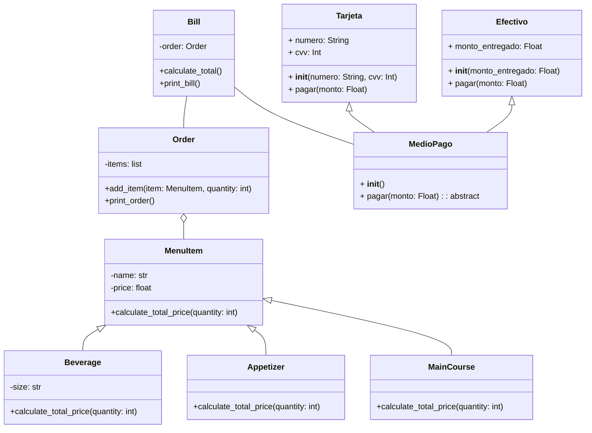
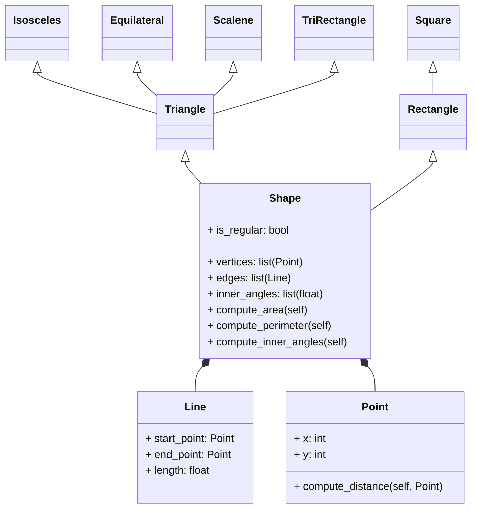

# Mermaid playing ""Cuenta de restaurante"
Este diagrama representa los elementos de un programa para calcular la factura del pedido de un cliente en un restaurante se adiciona la opcion de un medio de pago.
***

Este es el Codigo que desarolle como solucion al reto planteado,con respecto al ejercico anterior se adicionan getteers y setters para las subclases, una  opcion de  descuento en la compra de bebidas y adicionalmente la opcion de un medio de pago para la cuenta. (Al finalizar se muestra un ejemplo de uso del codigo)
```
class MenuItem:
    def __init__(self, name, price):
        self._name = name
        self._price = price

    def get_name(self):
        return self._name

    def set_name(self, name):
        self._name = name

    def get_price(self):
        return self._price

    def set_price(self, price):
        self._price = price

    def calculate_total_price(self, quantity):
        return self._price * quantity, 0  #  discount for general menu items

class Beverage(MenuItem):
    def __init__(self, name, price, size):
        super().__init__(name, price)
        self._size = size

    def get_size(self):
        return self._size

    def set_size(self, size):
        self._size = size

    def calculate_total_price(self, quantity):
        discount = 0
        if self.order.includes_main_course():
            discount = 0.1 * self._price * quantity  #  discount for beverages if order includes main course
        total_price = self._price * quantity - discount
        return total_price, discount

class Appetizer(MenuItem):
    pass


class MainCourse(MenuItem):
    pass


class Order:
    def __init__(self):
        self.items = []

    def add_item(self, item, quantity):
        self.items.append((item, quantity))
        item.order = self  # Assign the order to the item
    
    def includes_main_course(self):
        return any(isinstance(item, MainCourse) for item, quantity in self.items)

    def print_order(self):
        print("Order:")
        for item, quantity in self.items:
            total_price, discount = item.calculate_total_price(quantity)
            print(f"{item.get_name()} x {quantity} - Total: {total_price}, Descuento: {discount}")

class Bill:
    def __init__(self, order):
        self.order = order

    def calculate_total(self):
        total_bill = 0
        for item, quantity in self.order.items:
            total_price, discount = item.calculate_total_price(quantity)
            total_bill += total_price
        return total_bill

    def print_bill(self):
        print("Order:")
        for item, quantity in self.order.items:
            total_price, discount = item.calculate_total_price(quantity)
            print(f"{item.get_name()} x {quantity} - Total: {total_price}, Descuento: {discount}")
        print("Total a pagar:", self.calculate_total())


class MedioPago:
    def __init__(self):
        pass

    def pagar(self, monto):
        raise NotImplementedError("Subclases deben implementar pagar()")

class Tarjeta(MedioPago):
    def __init__(self, numero, cvv):
        super().__init__()
        self.numero = numero
        self.cvv = cvv

    def pagar(self, monto):
        print(f"Pagando {monto} con tarjeta {self.numero[-4:]}")
        return 0  # La tarjeta puede pagar cualquier monto


class Efectivo(MedioPago):
    def __init__(self, monto_entregado):
        super().__init__()
        self.monto_entregado = monto_entregado
        self.monto_pagado = 0  # Agrega esta línea

    def pagar(self, monto):
        if self.monto_entregado >= monto:
            print(f"Pago realizado en efectivo. Cambio: {self.monto_entregado - monto}")
            self.monto_pagado = monto  # Actualiza el monto pagado
            return 0
        else:
            print(f"Fondos insuficientes. Faltan {monto - self.monto_entregado} para completar el pago.")
            self.monto_pagado = self.monto_entregado  # Actualiza el monto pagado con lo que se tenía en efectivo
            return monto - self.monto_entregado  # Devuelve el monto restante

menu = {
    "Vino": Beverage("Vino", 65000, "botella"),
    "Agua": Beverage("Agua", 3000, "botella"),
    "Cerveza": Beverage("Cerveza", 10000, "botella"),
    "Papas": Appetizer("Papas", 13000),
    "Alitas": Appetizer("Alitas", 25000),
    "Churazco": MainCourse("Churazco", 45000),
    "Reve eye": MainCourse("Reve eye", 65000),
    "Salmon": MainCourse("Salmon", 55000),
    "Pasta Carbonara": MainCourse("Pasta Carbonara", 35000),
    "Pasta Bolognesa": MainCourse("Pasta Bolognesa", 35000),
}

order = Order()
order.add_item(menu["Vino"], 1)
order.add_item(menu["Alitas"], 1)
order.add_item(menu["Churazco"], 1)
order.add_item(menu["Reve eye"], 1)

bill = Bill(order)
bill.print_bill()
# pago 
total_a_pagar = bill.calculate_total()

# Pago en efectivo
efectivo = Efectivo(70000)  # Monto entregado
total_a_pagar = efectivo.pagar(total_a_pagar)
print(f"Valor pagado en efectivo: {efectivo.monto_pagado}")

# Si el efectivo no fue suficiente, paga el resto con tarjeta
if total_a_pagar > 0:
    tarjeta = Tarjeta("1234567890123456", 123)
    total_a_pagar = tarjeta.pagar(total_a_pagar)
```

# EJERCCIO DE FORMA  
Este fue el ejercicio propuesto en clase y su solucion 

# Mermaid playing ""SHAPE"
Este diagrama representa los elementos para  que apartir de la definicion de un punto se pueda crear  una linea  y asi  generar la  grafica de distintas figuras geometricas y el calculo de su area y perimmetero   .
***

Este es el codigo propuesto como sulucion al ejercicio, se desarrollo  un programa que permite, que apartir de un  punto con cordenas x e y, se  genere una linea y posteriormente la  grafica de  figuras geometricas como triangulos (de diferentes tipos), rectangulos y cuadrandos, definiendo los vertices y los angulos internos, se realiza el  uso de la libreria math de python para poder realizar el calculo del valor de los angulos, y las demas operaciones se realizan mediante formaluas de calculo de areas y perimetros  para cada tipo de  figuras geometrica, tambien se aplica el concepto de encapsulamiento de los metodos para las diferentes formas . 
```
import math
class Point:
    def __init__(self, x, y):
        self._x = x
        self._y = y

    def set_x(self, x):
        self._x = x

    def get_x(self):
        return self._x

    def set_y(self, y):
        self._y = y

    def get_y(self):
        return self._y

    def compute_distance(self, other):
        return ((self._x - other._x) ** 2 + (self._y - other._y) ** 2) ** 0.5


class Line:
    def __init__(self, start_point, end_point):
        self._start_point = start_point
        self._end_point = end_point
        self.length = start_point.compute_distance(end_point)

    def get_start_point(self):
        return self._start_point

    def set_start_point(self, start_point):
        self._start_point = start_point

    def get_end_point(self):
        return self._end_point

    def set_end_point(self, end_point):
        self._end_point = end_point


class Shape:
    def __init__(self, vertices, inner_angles):
        self.vertices = vertices
        self._inner_angles = inner_angles
        self.edges = [Line(vertices[i], vertices[(i + 1) % len(vertices)]) for i in range(len(vertices))]
        self._inner_angles = self.compute_inner_angles()
        self.is_regular = self.compute_is_regular()

    def compute_inner_angles(self):
        angles = []
        for i in range(len(self.vertices)):
            p1 = self.vertices[i]
            p2 = self.vertices[(i + 1) % len(self.vertices)]
            p3 = self.vertices[(i + 2) % len(self.vertices)]
            angle = self.compute_angle(p1, p2, p3)
            angles.append(angle)
        return angles

    def compute_angle(self, p1, p2, p3):
        d1 = p1.compute_distance(p2)
        d2 = p2.compute_distance(p3)
        d3 = p3.compute_distance(p1)
        numerator = d1 ** 2 + d3 ** 2 - d2 ** 2
        denominator = 2 * d1 * d3
        # Manejar divisiones por cero
        if denominator == 0:
            return 0
        # Calcular el ángulo utilizando teorema de coseno
        angle_rad = math.acos(numerator / denominator)
        # Convertir radianes a grados
        angle_deg = angle_rad * 180 / math.pi
        return angle_deg

    def compute_is_regular(self):
        return len(set(self._inner_angles)) == 1

    def get_vertices(self):
        return self._vertices

    def set_vertices(self, vertices):
        self._vertices = vertices

    def get_inner_angles(self):
        return self._inner_angles

    def set_inner_angles(self, inner_angles):
        self._inner_angles = inner_angles


class Triangle(Shape):
    def __init__(self, vertices, inner_angles):
        super().__init__(vertices, inner_angles)
        self.type = self.determine_type()

    def determine_type(self):
        a, b, c = sorted([edge.length for edge in self.edges])
        # tolerancia de error (1e-6) para comparar las longitudes de los lados.
        if abs(a ** 2 + b ** 2 - c ** 2) < 1e-6:
            return "Rectangulo"
        elif a == b == c:
            return "Equilatero"
        elif a == b or b == c:
            return "Isosceles"
        else:
            return "Escaleno"

    def compute_area(self):
        a, b, c = sorted([edge.length for edge in self.edges])
        if self.type == "Rectangulo":
            # Para un triangulo rectangulo, el área es (base * altura)/2
            return 0.5 * a * b
        elif self.type == "Isósceles":
            # Para un triángulo isósceles, el area es base * raiz cuadrada((lado^2) - (base^2 / 4)) / 2
            base = a if a != b else c
            side = b if a == b else a
            return base * ((side ** 2 - (base ** 2 / 4)) ** 0.5) / 2
        elif self.type=="Equilatero":
            #Para un tirangulo equilatero calculamos el area con ((raizcuadrada 3)/) * lado al cuadrado
            a = self.edges[0].length
            return ((3 ** 0.5) / 4) * a ** 2
        else:
            # Para un triángulo escaleno, utilizamos la formula de Heron donde s=semiperimetro
            s = (a + b + c) / 2
            return (s * (s - a) * (s - b) * (s - c)) ** 0.5

    def compute_perimeter(self):
        # La suma de los lados
        return sum(edge.length for edge in self.edges)
    
class EquilateralTriangle(Triangle):
    def __init__(self, vertices, inner_angles):
        super().__init__(vertices, inner_angles)

    def compute_area(self):
        # Área de un triángulo equilátero
        a = self.edges[0].length
        return ((3 ** 0.5) / 4) * a ** 2

    def get_vertices(self):
        return super().get_vertices()

    def set_vertices(self, vertices):
        super().set_vertices(vertices)


class RectangleTriangle(Triangle):
    def __init__(self, vertices, inner_angles):
        super().__init__(vertices, inner_angles)

    def compute_area(self):
        # area de un triángulo rectangulo
        a = self.edges[0].length
        b = self.edges[1].length
        return 0.5 * a * b

    def get_vertices(self):
        return super().get_vertices()

    def set_vertices(self, vertices):
        super().set_vertices(vertices)


class ScaleneTriangle(Triangle):
    def __init__(self, vertices, inner_angles):
        super().__init__(vertices, inner_angles)

    def compute_area(self):
        # Usando la fórmula de Heron
        a = self.edges[0].length
        b = self.edges[1].length
        c = self.edges[2].length
        s = (a + b + c) / 2
        return (s * (s - a) * (s - b) * (s - c)) ** 0.5

    def get_vertices(self):
        return super().get_vertices()

    def set_vertices(self, vertices):
        super().set_vertices(vertices)


class IsoscelesTriangle(Triangle):
    def __init__(self, vertices, inner_angles):
        super().__init__(vertices, inner_angles)

    def compute_area(self):
        # area de un triángulo isosceles
        a, b, c = sorted([edge.length for edge in self.edges])
        base = a if a != b else c
        side = b if a == b else a
        return base * ((side ** 2 - (base ** 2 / 4)) ** 0.5) / 2

    def get_vertices(self):
        return super().get_vertices()

    def set_vertices(self, vertices):
        super().set_vertices(vertices)


class Rectangle(Shape):
    def compute_area(self):
        # la multiplicacion de los lados b*h
        return self.edges[0].length * self.edges[1].length

    def compute_perimeter(self):
        # se suma la medida de los lados 
        return 2 * (self.edges[0].length + self.edges[1].length)

    def get_vertices(self):
        return super().get_vertices()

    def set_vertices(self, vertices):
        super().set_vertices(vertices)


class Square(Rectangle):
    def compute_area(self):
        # para el area multiplicamos l*l
        return self.edges[0].length ** 2

    def compute_perimeter(self):
        # sumamos 4 veces la medida del lado  
        return 4 * self.edges[0].length

    def get_vertices(self):
        return super().get_vertices()

    def set_vertices(self, vertices):
        super().set_vertices(vertices)

p1 = Point(0, 0)
p2 = Point(0, 2)
p3 = Point(11, 11)

# Crea un triángulo y determina su tipo
triangle = Triangle(vertices=[p1, p2, p3], inner_angles=[p1, p2, p3])
triangle_type = triangle.type
print("Tipo de triángulo:", triangle_type)

# Dependiendo del tipo de triángulo, crea una instancia de la clase correcta
if triangle_type == "Rectángulo":
    triangle = Rectangle(vertices=[p1, p2, p3], inner_angles=[p1, p2, p3])
elif triangle_type == "Isosceles":
    triangle = IsoscelesTriangle(vertices=[p1, p2, p3], inner_angles=[p1, p2, p3])
elif triangle_type == "Equilatero":
    triangle = EquilateralTriangle(vertices=[p1, p2, p3], inner_angles=[p1, p2, p3])
elif triangle_type == "Escaleno":
    triangle = EquilateralTriangle(vertices=[p1, p2, p3], inner_angles=[p1, p2, p3])

# Calcula e imprime el area y el perímetro del triangulo
print("Área del triángulo:", triangle.compute_area())
print("Perímetro del triángulo:", triangle.compute_perimeter())

# Para el rectangulo y el cuadrado, el cóoigo permanece igual
rectangle = Rectangle(vertices=[p1, Point(5, 0), Point(5, 3), Point(0, 3)], inner_angles=[p1, Point(5, 0), Point(5, 3), Point(0, 3)])
print("Área del rectángulo:", rectangle.compute_area())
print("Perímetro del rectángulo:", rectangle.compute_perimeter())

square = Square(vertices=[p1, Point(3, 0), Point(3, 3), Point(0, 3)], inner_angles=[p1, Point(3, 0), Point(3, 3), Point(0, 3)])
print("Área del cuadrado:", square.compute_area())
print("Perímetro del cuadrado:", square.compute_perimeter())
```


